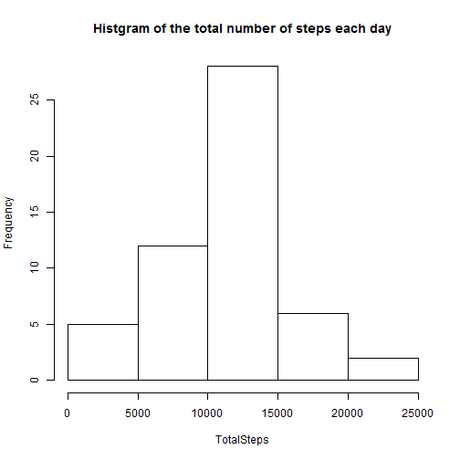
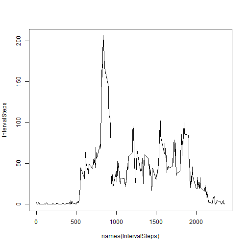
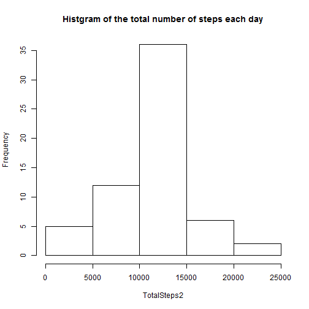

## Loading and preprocessing the data


```r
#set working directory and language
setwd("F:/coursra/5_Reproducible_Research/homework")
Sys.setlocale("LC_TIME","English")
```

```
## [1] "English_United States.1252"
```

```r
#load the data
activity <- read.csv("./activity.csv",colClasses=c("integer","Date","integer"))
summary(activity)
```

```
##      steps             date               interval     
##  Min.   :  0.00   Min.   :2012-10-01   Min.   :   0.0  
##  1st Qu.:  0.00   1st Qu.:2012-10-16   1st Qu.: 588.8  
##  Median :  0.00   Median :2012-10-31   Median :1177.5  
##  Mean   : 37.38   Mean   :2012-10-31   Mean   :1177.5  
##  3rd Qu.: 12.00   3rd Qu.:2012-11-15   3rd Qu.:1766.2  
##  Max.   :806.00   Max.   :2012-11-30   Max.   :2355.0  
##  NA's   :2304
```

## What is mean total number of steps taken per day?

Calculate the total number of steps taken per day. And make a histogram of the total number of steps taken each day.

```r
#mean total number of steps per day
activity2 <- activity[!is.na(activity$steps),]
TotalSteps <- tapply(activity2$steps,activity2$date,sum)
hist(TotalSteps, main = "Histgram of the total number of steps each day")
```

 

```r
mean1 <- mean(TotalSteps)
median1 <- median(TotalSteps)
```

The mean and median of the total number of steps taken per day are 1.0766189 &times; 10<sup>4</sup> and 10765, respectively.            

## What is the average daily activity pattern?

Make a time series plot of the 5-minute interval (x-axis) and the average number of steps taken, averaged across all days (y-axis).

```r
IntervalSteps <- tapply(activity2$steps,activity2$interval,mean)
plot(names(IntervalSteps),IntervalSteps, type = "l", main = "")
```

 

```r
maxInterval <- names(IntervalSteps)[which.max(IntervalSteps)]
maxsteps <- max(IntervalSteps)
```

The 835 5-minute interval contains the maximum number of steps:    206.1698113.

## Imputing missing values

Calculate the total number of missing values in the dataset.

```r
sum(is.na(activity$steps))
```

```
## [1] 2304
```

Use the average number of steps for 5-minute interval to fill in all of the missing values in the dataset. Create a new dataset that is equal to the original dataset but with the missing data filled in.

Make a histogram of the total number of steps taken each day.

```r
fillNA <- function(activity){
        inter <- as.character(activity[is.na(activity$steps),"interval"])
        activity[is.na(activity$steps),"steps"] <- IntervalSteps[inter]
        activity
}
activity3 <- fillNA(activity)
TotalSteps2 <- tapply(activity3$steps,activity3$date,sum)
hist(TotalSteps2, main = "Histgram of the total number of steps each day")
```

 

```r
mean2 <- mean(TotalSteps2)
median2 <- median(TotalSteps2)
```

The mean and median total number of steps taken per day are 1.0766189 &times; 10<sup>4</sup> and 1.0766189 &times; 10<sup>4</sup>, respectively.       

After filling in the missing values, the histogram of the total number of steps taken each day changes. The mean total number of steps taken per day remains the same and the median acquires a slight increase.

## Are there differences in activity patterns between weekdays and weekends?

Create a new factor variable in the dataset with two levels – “weekday” and “weekend” indicating whether a given date is a weekday or weekend day. Make a panel plot containing a time series plot of the 5-minute interval (x-axis) and the average number of steps taken, averaged across all weekday days or weekend days (y-axis).


```r
activity3$week <- mapply(function(date) if(weekdays(date) %in% c("Saturday","Sunday")){"weekend"}
       else{"weekday"}, activity3$date)

library(lattice)
library(reshape2)
avtivitymelt <- melt(activity3,id=c("week","interval"), measure.vars=c("steps"))
meltData <- dcast(avtivitymelt , week + interval~ variable,mean)
xyplot(steps ~ interval| week, data = meltData, type = "l", layout = c(1, 2),
       ylab = "Number of steps", xlab = "Interval")
```

 
